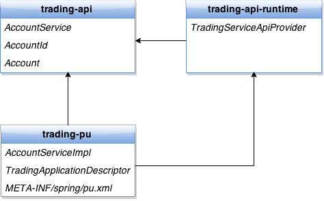

This is a step by step tutorial that show how to provide a simple service using Astrix and GigaSpaces. A complete example is located in the [examples folder](https://github.com/AvanzaBank/astrix/tree/master/tutorial/trading-api-parent).

Astrix uses a declarative programming model where the programmer typically uses annotations to express thing such as:

* `AccountService` is a remote service that is discovered using the service registry
* This application exports a remote service endpoint for `AccountService`

Based on such metadata the Astrix Framework will run service discovery against the service registry when a consumer requests an instance of `AccountService`, or register with the service registry that the current application provides `AccountService` using Astrix-remoting over GigaSpaces. That is, the programmer expresses "what", and Astrix knows "how".

Every API provided using Astrix begins with an `ApiProvider`. An `ApiProvider` defines what beans are part of an API and how Astrix will create an instance of each corresponding type at runtime. Similarly an `ApplicationDescriptor` defines what services a given server exports, and how these services can be invoked. The following example shows how to implement an `ApiProvider` and an `ApplicationDescriptor` for a simple trading API.

The API has the following layout:



### trading-api
The API consists of an `Account` representation, a corresponding id type (`AccountId`), and a service (`AccountService`). Each is a regular POJO with one Astrix specific exception. The `@AstrixRouting` annotation tells Astrix that invocations to `AccountService` should be routed on the `AccountId` argument in a partitioned environment:

```java
package se.avanzabank.trading.api;

public interface AccountService {
	Account getAccount(@AstrixRouting AccountId accountId);
}
```

### trading-api-runtime
In order to consume `AccountService` using Astrix there must exist an `ApiProvider` that exports `AccountService` as an Astrix bean. Bean is the name used by Astrix for each type that is exported as part of an API. There are two types of beans, __library__ and __service__. We won't go into the details about the difference between the two, but remoting services are typically exported as __service__ beans.

For the trading-api the `ApiProvider` looks like this:

```java
package se.avanzabank.trading.api.runtime;

@AstrixApiProvider
public interface TradingServiceApiProvider {
	@Service
	AccountService accountService();
}
```

The `@AstrixApiProvider` annotation identifies an `ApiProvider`. Astrix uses classpath scanning to find all `ApiProvider's` on the classpath. 

`TradingServicApiProvider` exports `AccountServcie` by defining a method with `AccountService` as return type and annotating it with `@Service`, which tells Astrix how to __bind__ to an instance of the given bean:

1. Discover the service using the service registry
2. Use information from service discovery to bind to the service

The __service registry__ is an application that allows applications to register what services they provide, and to discover providers for a given service.


### trading-pu
The last module is the server, in this case in the form of a GigaSpaces processing unit. An Astrix server is defined by an `ApplicationDescriptor`. For the trading-pu it looks like this:

```java
@AstrixApplication(
	exportsRemoteServicesFor = TradingServiceApiProvider.class,
	defaultServiceComponent = AstrixServiceComponentNames.GS_REMOTING
)
public class TradingApplicationDescriptor {
}
```

The `TradingApplicationDescriptor` defines two things:

1. That the given server provides remote services for each service defined in `TradingServiceApiProvider`
2. That the default mechanism to export a service is Astrix remoting using GigaSpaces as transport.

> An `ApplicationDescriptor` can be seen as the server side counterpart to an `ApiProvider`. While an `ApiProvider` defines what beans are part of an api and how instances of these are created, an `ApplicationDescriptor` defines what services a server provides, and how these can be invoked.

Astrix delegates incoming service invocations to `AccountService` to a corresponding implementation. In order for Astrix to find an implementation of `AccountService` it has to be annotated with `@AstrixServiceExport`:

```java
package se.avanzabank.trading.pu;

@AstrixServiceExport(AccountService.class)
public class AccountServiceImpl implements AccountService {
	// Implementation
}
```

During startup of the trading-pu Astrix will register with the service registry, announcing that it provides `AccountService` using "GS_REMOTING". Astrix scans all spring beans on startup and collects `@AstrixServiceExport` annotated beans. These beans will be used at runtime to dispatch incoming service invocation to the corresponding service implementation.

The last piece in the puzzle exists in `pu.xml` (the spring application context configuration file). The spring bean `AstrixFrameworkBean` loads the Astrix framework. The `applicationDescriptor` property identifies that the current application is a server. When that property is set the server part of the framework will be loaded and all services defined in `TradingApplicationDescriptor` will be provided. For the trading-pu Astrix will start a background thread that periodically registers the server in the service registry, and load all classes required to export the provided service using the defined `ServiceComponent`.

### pu.xml
```xml
<?xml version="1.0" encoding="UTF-8"?>
<beans xmlns="http://www.springframework.org/schema/beans"
	xmlns:xsi="http://www.w3.org/2001/XMLSchema-instance"
	xmlns:context="http://www.springframework.org/schema/context"
	xmlns:os-core="http://www.openspaces.org/schema/core"
	xsi:schemaLocation="http://www.openspaces.org/schema/core http://www.openspaces.org/schema/core/openspaces-core.xsd
		http://www.springframework.org/schema/beans http://www.springframework.org/schema/beans/spring-beans.xsd
		http://www.springframework.org/schema/context http://www.springframework.org/schema/context/spring-context.xsd">

	<context:annotation-config/>
	<os-core:space id="space" url="/./trading-space"/>
	<os-core:giga-space id="gigaSpace" space="space"/>
    
	<bean class="com.avanza.astrix.spring.AstrixFrameworkBean">
		<property name="applicationDescriptor"	
			 value="se.avanzabank.trading.pu.TradingApplicationDescriptor"/>
	</bean>
	<bean class="se.avanzabank.trading.pu.AccountServiceImpl"/>
	    
</beans>

```

### Consuming the Trading API
Each client that want to consume the Trading API has to create an `AstrixContext` and use it as a factory to create instances of the beans that are part of the api. There are two ways to create an `AstrixContext`. The first one is to use an `AstrixFrameworkBean` as in the pu.xml above, which will create an register an `AstrixContext` in the current spring application context. The other option, most used in unit testing, is to create the context using an `AstrixConfigurer`:

```java
AstrixConfigurer configurer = new AstrixConfigurer();
configurer.set(AstrixSetting.SERVICE_REGISTRY_URI, 
	"gs-remoting:jini://*/*/service-registry?groups=elilin");
AstrixContext context = configurer.configure();
AccountService accountService = context.getBean(AccountService.class);
```

Astrix allows for a lot of configuration, see the `AstrixSettings` class. In practice you always have to define where the service registry is located by setting the `AstrixSettings.SERVICE_REGISTRY_URI`, see [Service Discovery and Service Binding](https://github.com/AvanzaBank/astrix/wiki/Service-Discovery-and-Service-Binding) for more information about serviceUri's. Also, in order for Astrix to find the `TradingServiceApiProvider` it must be configured to scan the appropriate part of the classpath (by default it only scans the `com.avanza.astrix` package). This can be configured in the same way as the serviceUri for the service registry, but since the package name for an `ApiProvider` doesn't change between different environments the recommended way to configure scanning is by creating a `META-INF/astrix/settings.properties` and put it in a shared jar. The `META-INF/astrix/settings.properties` allows overriding of the default value for each Astrix settings, for instance the base package used when scanning for `ApiProvider`'s:

### META-INF/astrix/settings.properties
```properties
AstrixApiProviderScanner.basePackage=se.avanzabank
```

Thats it, now you now the mechanics for providing and consuming a service using Astrix.


