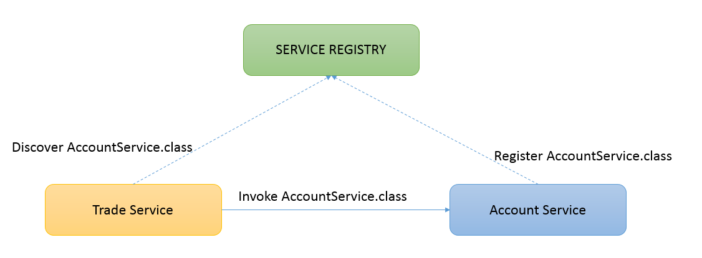

> This is a very early draft

The service registry is the most common way to do service discovery. It is a service that allows dynamic service registration. Astrix implements "self service registration" using the service registry.

The service registry is a service shipped with the framework. It is provided using the same ServiceComponent framework as any other service implemented using Astrix. The biggest difference is that all consumers of the service registry uses config-discovery to find the service registry (to avoid a bootstrap problem).

You never interact with the service registry directly. Its used by the framework behind the scenes by service consumers to do service discovery, and by service providers to make its services available.

### How a consumer discovers a provider using the service registry
 

Its important to note that Astrix does use the service registry to discover "service"-endpoints in the registry. Rather it discovers a binding-mechanism and associated properties.


The Astrix view of a service:

```java
interface OrderValidation {
    ValidationResult validateOrder(Order order);
}
```

### Configuring what service registry to use
Astrix uses the configuration to discovery a provider for the service registry, see [Configuring Astrix](Configuring-Astrix) for more information. <p>


### Deploying a Service Registry
Astrix ships with an implementation of a service registry based on GigaSpaces. This implementation is located in the `astrix-service-registry-pu` module.

The module is not packaged as a [processing-unit](http://docs.gigaspaces.com/xap101/the-processing-unit-structure-and-configuration.html), so in order to deploy it you have to package it as a processing-unit yourself:

1. Create a module for your service-registry
2. Add a dependency to `astrix-service-registry-pu`
3. Inside the module create a `/META-INF/services/pu.xml` with the content below:
4. Package this module as a processing-unit and you should be able to deploy it.

### Content of /META-INF/services/pu.xml
```xml
<beans xmlns="http://www.springframework.org/schema/beans"
	xmlns:xsi="http://www.w3.org/2001/XMLSchema-instance"
	xsi:schemaLocation="http://www.springframework.org/schema/beans http://www.springframework.org/schema/beans/spring-beans.xsd">

	<import resource="classpath*:/META-INF/spring/service-registry-pu.xml" />
</beans>
```


